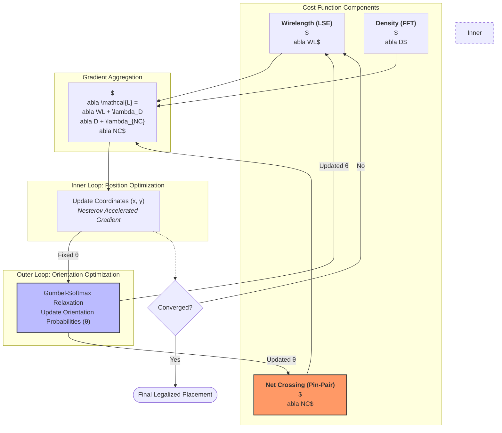

# Cypress gradient flow diagram

```mermaid
graph TD
    subgraph "Cost Function Components"
        WL["<b>Wirelength (LSE)</b><br/>$\nabla WL$"]
        D["<b>Density (FFT)</b><br/>$\nabla D$"]
        NC["<b>Net Crossing (Pin-Pair)</b><br/>$\nabla NC$"]
    end

    subgraph "Gradient Aggregation"
        Sum["$\nabla \mathcal{L} = \nabla WL + \lambda_D \nabla D + \lambda_{NC} \nabla NC$"]
    end

    subgraph "Inner Loop: Position Optimization"
        UpdateXY["Update Coordinates (x, y)<br/><i>Nesterov Accelerated Gradient</i>"]
    end

    subgraph "Outer Loop: Orientation Optimization"
        Gumbel["Gumbel-Softmax Relaxation<br/>Update Orientation Probabilities (θ)"]
    end

    %% Flow connections
    WL --> Sum
    D --> Sum
    NC --> Sum
    
    Sum --> UpdateXY
    UpdateXY --> |Fixed θ| Gumbel
    Gumbel --> |Updated θ| WL
    Gumbel --> |Updated θ| NC

    %% Convergence
    UpdateXY -.-> Conv{Converged?}
    Conv -->|No| WL
    Conv -->|Yes| End([Final Legalized Placement])

    style NC fill:#f96,stroke:#333,stroke-width:2px
    style Gumbel fill:#bbf,stroke:#333,stroke-width:2px
    style Inner Loop fill:#fff,stroke-dasharray: 5 5
```