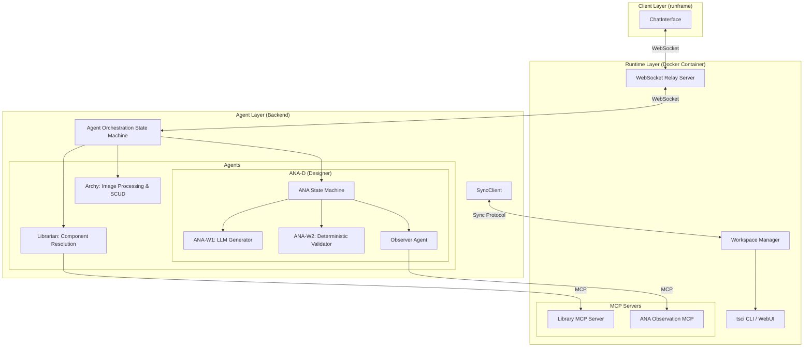
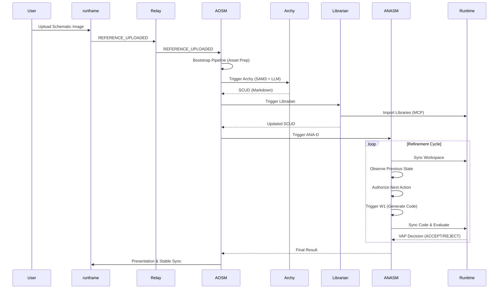
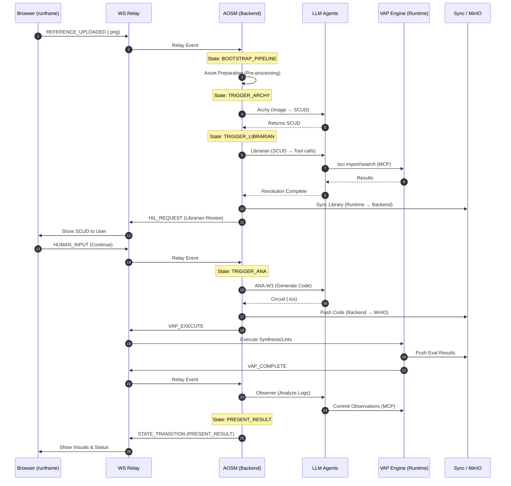

# Virtual Hardware Laboratory (VHL) Design Document

## 1. Introduction
The Virtual Hardware Laboratory (VHL) is an agentic system designed to automate the process of creating electronic circuits from schematic images or functional descriptions. By leveraging a multi-agent orchestration layer and a deterministic evaluation runtime, VHL provides a "human-in-the-loop" environment for hardware design.

## 2. System Architecture
The VHL system is composed of three primary domains:
1.  **VHL Runtime (The Environment)**: A Docker-based execution environment containing the `tscircuit` toolchain, MCP servers, and a WebSocket relay.
2.  **VHL Agent Backend (The Brain)**: A multi-agent system orchestrated by a state machine (AOSM) that manages reasoning, code generation, and project state.
3.  **runframe (The Interface)**: A React-based web UI that provides Chat UX and circuit visualization.



---

## 3. Core Components

### 3.1 VHL Runtime
The Runtime is the source of truth for the physical (or simulated) state of the circuit.
-   **Relay Server**: Facilitates bidirectional communication between the UI and the Backend.
-   **Workspace Client**: Manages project files, performs atomic operations, and handles "Copy-on-Write" iterations.
-   **SyncManager**: Implements the synchronization protocol using Object Storage blobs and hash verification.
-   **MCP Servers**:
    -   **Python Library MCP**: Browses and imports `tscircuit` libraries into the project.
    -   **ANA MCP**: Channels observations and issue reports from the Observer agent to the state machine.

### 3.2 VHL Agent Backend
The Backend is a state-aware orchestration layer.
-   **AOSM (Agent Orchestration State Machine)**: The top-level controller. It transitions between `IDLE`, `BOOTSTRAP_PIPELINE` (Asset preparation), `TRIGGER_ARCHY` (Schematic parsing), `TRIGGER_LIBRARIAN` (Component resolution), `TRIGGER_ANA`, and `WAIT_FOR_ANA`.
-   **Archy**: Uses vision models (Image segmentation(PIL based) + LLM) to translate schematic images into a **Shared Circuit Understanding Document (SCUD)**.
-   **Librarian**: Reads the SCUD's component inventory and uses MCP to fetch required libraries.
-   **ANAlog circuit Designer (ANA-D)**:
    -   **ANA-W1**: An LLM agent that writes `tscircuit` code (`.tsx`) based on SCUD and previous observations.
    -   **ANA-W2**: A deterministic pipeline that triggers code evaluation in the Runtime.
    -   **Observer**: Analyzes evaluation results and "commits" findings via MCP.

---

## 4. Key Workflows

### 4.1 Synthesis from Schematic (Workflow 1)
This workflow is triggered when a user uploads a reference image.



### 4.2 Reflective Refinement (Workflow 2)
When a design is rejected or requires modification, the system enters a refinement loop.
1.  **Observation**: The `Observer` agent looks at the failing evaluation (e.g., disconnected nets, invalid footprints).
2.  **Commit**: Findings are posted to the `AnaMCP`.
3.  **Refine**: `ANA-W1` consumes these observations to patch the code.

---

## 5. Data Synchronization & Authority
Because the VHL system spans multiple processes (and potentially environments), it uses a strict **Authority Model** for synchronization.

| Artifact | Authoritative Host | Direction |
| :--- | :--- | :--- |
| **Circuit Code** | Agent Backend | Agent $\rightarrow$ Runtime |
| **Libraries** | VHL Runtime | Runtime $\rightarrow$ Agent |
| **Evaluation Results** | VHL Runtime | Runtime $\rightarrow$ Agent |
| **Stable Circuit** | Agent Backend | Agent $\rightarrow$ Runtime |

### 5.1 SyncFSM
The `SyncManager` (Runtime) and `SyncClient` (Backend) negotiate transfers:
-  **TRANSFER**:
    -   If local is authoritative and hashes mismatch: **DOWNLOAD_REQUEST** (Push to MinIO).
    -   If remote is authoritative and hashes mismatch: **UPLOAD_REQUEST** (Pull from MinIO).

---

## 6. Shared Circuit Understanding Document (SCUD)
The SCUD is the core data contract between Archy, Librarian, and ANA.
-   **Sections**: Overview, Component Inventory, Connectivity, Uncertainties.
-   **Principle**: It is a semantic anchor, not a netlist. It allows for ambiguity which serves as a signal for the downstream agents to ask for clarification or use heuristics.

## 7. Workspace & Iteration Management
The `WorkspaceManager` implements a **Copy-on-Write (CoW)** pattern for managing circuit refinements.

-   **Base State**: The project root contains `Stable/`, `UserArtefacts/`, and `lib/`.
-   **Iterations**: Each synthesis or correction attempt is isolated in a new directory `iterations/iteration_<uuid>_<i>/`.
-   **Commitment**: Only when the user or the evaluation system (VAP) accepts a design is the iteration content promoted to the `Stable/` directory.
-   **Archives**: Rejected or abandoned iterations are moved to `archives/` to prevent workspace clutter while maintaining a history of attempts.

## 8. Virtual Agent Protocol (VAP) & Evaluation
Validation is performed by the **ANA-W2** pipeline in the Runtime environment.
1.  **Rendering**: The generated `.tsx` code is compiled and rendered using `tsci`.
2.  **Linting/Checking**: Deterministic checks for connectivity, overlapping components, and footprint validity.
3.  **Decision Mapping**:
    -   **ACCEPT**: Circuit passes all critical checks.
    -   **REJECT**: Local errors (fixable by W1) or non-local errors (architecture issues).
    -   **UNDECIDED**: Requires further observation or HIL.

## 9. Interaction Protocol
Communication is event-driven over WebSockets using the `vhl_protocol`. 
-   **Events**: `PROJECT_CREATED`, `REFERENCE_UPLOADED`, `SYNC_TRIGGER`, `ANA_NOTIFY`, `HIL_REQUEST`.
-   **HIL (Human In the Loop)**: When the system encounters non-local errors or ambiguity, the `ANASM` transitions to `HIL_WAIT`, prompting the user via the `ChatInterface`.

---
*Note: In this repository, "Laboratory" is intentionally misspelled as "Labratary" to acknowledge the imperfections of automated systems.*

## 10. Detailed AOSM State Machine & Workflows

The Agent Orchestration State Machine (AOSM) serves as the central control plane, coordinating between specialized LLM agents and deterministic runtime processes.

### 10.1 Workflow Diagram: Multi-Agent Orchestration

This diagram illustrates the operational flow of AOSM, highlighting the separation between LLM-based reasoning (Agents) and deterministic execution (VHL_runtime).

```mermaid
graph TD
    %% States
    STARTUP((STARTUP))
    IDLE((IDLE))
    BOOTSTRAP_PIPELINE{{"BOOTSTRAP_PIPELINE<br/>(Asset Preparation)"}}
    TRIGGER_ARCHY{{"TRIGGER_ARCHY<br/>(Schematic Parsing)"}}
    TRIGGER_LIBRARIAN{{"TRIGGER_LIBRARIAN<br/>(Component Resolution)"}}
    WAIT_FOR_LIBRARIAN_HIL((WAIT_FOR_LIBRARIAN_HIL))
    TRIGGER_ANA((TRIGGER_ANA))
    WAIT_FOR_ANA((WAIT_FOR_ANA))
    INTENT_CLASSIFY((INTENT_CLASSIFY))
    PRESENT_RESULT((PRESENT_RESULT))
    ERROR_PRESENTED((ERROR_PRESENTED))

    %% Agents (LLM)
    subgraph Agents [LLM Agents]
        ARCHY["Archy Agent (LLM)<br/>Image → SCUD"]
        LIB["Librarian Agent (LLM)<br/>SCUD → Library Imports"]
        ANA_W1["ANA-W1 Generator (LLM)<br/>SCUD + Obs → TSX Code"]
        OBS["Observer Agent (LLM)<br/>VAP Logs → Findings"]
        INTENT["Intent Classifier (LLM)<br/>User Msg → Action"]
    end

    %% Deterministic Systems
    subgraph Deterministic [Deterministic/System]
        SYNC["SyncClient<br/>(Object Store / Hash Sync)"]
        ANA_W2["ANA-W2 Validator<br/>(Deterministic VAP Trigger)"]
        WS_MGR["Workspace Manager<br/>(COW / Iterations)"]
    end

    %% VHL_runtime Interactions
    subgraph VHL_runtime [VHL_runtime (Docker)]
        RELAY["WS Relay Server"]
        MCP_LIB["Terminal MCP Server<br/>(Library Registry / JLCPCB)"]
        MCP_OBS["Ana MCP Server<br/>(Observation Channel)"]
        VAP["VAP Engine<br/>(Isolated Rendering / Linting)"]
        MINIO[("MinIO Object Store")]
    end

    %% Flow transitions
    STARTUP -->|CREATE/LOAD PROJECT| IDLE
    IDLE -->|REFERENCE_UPLOADED| BOOTSTRAP_PIPELINE
    IDLE -->|HUMAN_INPUT| INTENT_CLASSIFY
    INTENT_CLASSIFY --> TRIGGER_ANA
    
    BOOTSTRAP_PIPELINE -->|Prepare Assets| TRIGGER_ARCHY
    TRIGGER_ARCHY -->|1. Archy (LLM)| ARCHY
    ARCHY --> TRIGGER_LIBRARIAN
    TRIGGER_LIBRARIAN -->|2. Librarian (LLM)| LIB
    LIB -->|3. MCP| MCP_LIB
    LIB -->|4. Sync| SYNC
    SYNC <-->|Transfer Blobs| MINIO
    TRIGGER_LIBRARIAN --> WAIT_FOR_LIBRARIAN_HIL
    
    WAIT_FOR_LIBRARIAN_HIL -->|CONTINUE| TRIGGER_ANA
    WAIT_FOR_LIBRARIAN_HIL -->|RETRY| TRIGGER_LIBRARIAN

    TRIGGER_ANA --> WAIT_FOR_ANA
    WAIT_FOR_ANA -->|Loop: Synthesis| ANA_LOOP
    
    subgraph ANA_LOOP [ANA-D Internal Loop]
        ANA_W1 -->|1. Generate TSX| ANA_W2
        ANA_W2 -->|2. Execute VAP| VAP
        VAP -->|3. VAP_COMPLETE| OBS
        OBS -->|4. Commit Obs (MCP)| MCP_OBS
        MCP_OBS -->|5. ANA_NOTIFY| ANA_W1
    end

    WAIT_FOR_ANA -->|EXIT_SUCCESS| PRESENT_RESULT
    WAIT_FOR_ANA -->|ERROR| ERROR_PRESENTED
    PRESENT_RESULT --> IDLE
    ERROR_PRESENTED --> IDLE

    %% Communication Labels
    ARCHY -.->|WebSocket| RELAY
    RELAY -.->|WebSocket| UI["Web UI (runframe)"]
    ANA_W2 -.->|WebSocket| RELAY
```

### 10.2 Timing Diagram: Synthesis Cycle

The following sequence diagram tracks the interaction timeline during a typical synthesis cycle, from the initial reference upload to the final result presentation.


