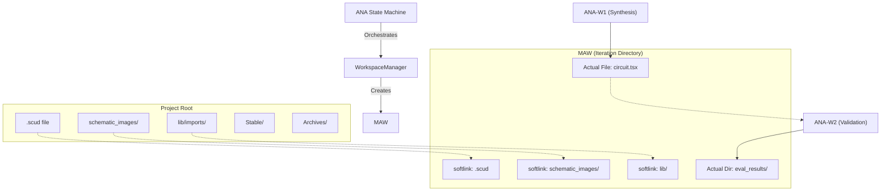

# Mirrored Attempt Workspace (MAW) - System Implementation

A **Mirrored Attempt Workspace (MAW)** is a specialized architectural pattern designed for autonomous agents. It provides a disposable, isolated environment that mirrors the production project structure through symbolic links, allowing agents to safely modify artifacts and perform iterations without risking the integrity of the main project.

## Overview

In the VHL (Virtual Hardware Laboratory) system, MAW is primarily used during the **ANA (ANA Circuit Synthesis and Validation)** process. It ensures that agents like `ANA-W1` (Synthesis) and `ANA-W2` (Validation) work in a context that looks exactly like the real project but is actually a sandbox.

### Key Concepts

*   **Project Root**: The source of truth containing reference schematics, SCUDs, and stable results.
*   **Iteration Directory**: The MAW itself. A temporary folder where the "Attempt" happens.
*   **Mirroring**: The use of softlinks to expose read-only resources from the Project Root into the Iteration Directory.
*   **Archiving**: The process of moving all iteration data to a timestamped archive once a session is complete.

## Architecture

The following diagram illustrates how MAW bridges the gap between the static project resources and the dynamic agent activities.

## Implementation Details

### 1. WorkspaceManager (The Factory)

The `WorkspaceManager` class in [manager.py](file:///home/pst/Documents/VHL-V0.01/VHL_agent_backend/workspace/manager.py) is responsible for the lifecycle of a MAW.

#### `_setup_symlinks(target_dir)`
This method creates the "mirror" by establishing relative symbolic links.
- **Resources Linked**: 
    - `schematic_images/`
    - `tsci_built_in_elements/`
    - `{circuit_name}.scud` (aliased as `circuit.scud` if needed)
    - `lib/imports/`
- **Portability**: It uses `os.path.relpath` to ensure links remain valid regardless of the absolute path of the workspace.

#### `create_new_iteration(hash_val)`
1.  Generates a unique iteration ID (e.g., `0004_a7b2c3d4`).
2.  Creates a physical directory under `Iterations/`.
3.  Invokes `_setup_symlinks` to populate it with mirrors.
4.  Carries over results (e.g., `.tsx` files) from the `previous_iteration_path` to provide continuity.

### 2. ANA State Machine (The Orchestrator)

The `ANADStateMachine` in [ana_sm.py](file:///home/pst/Documents/VHL-V0.01/VHL_agent_backend/ana/ana_agent/state_machine/ana_sm.py) manages the transition between iterations.

- **Initialization**: `_handle_init` creates a new MAW for every step.
- **W1 Execution**: The agent is invoked with the MAW path as its working directory. It sees a full project but can only write to its local MAW.
- **W2 Validation**: Uses the same MAW to run tests and store `eval_results/`.
- **Commit Logic**: Upon successful validation (`EXIT_SUCCESS`), the `populate_stable` method copies the final artifacts from the MAW to the `Stable/` directory.

## Lifecycle of a MAW

1.  **Creation**: `WorkspaceManager` creates a timestamped iteration folder and links global resources.
2.  **Attempt**: `ANA-W1` generates or fixes circuit code within the MAW.
3.  **Observation**: If errors occur, `ObserverAgent` analyzes the MAW's state (code + eval results).
4.  **Recycle**: `ANADStateMachine` triggers a new iteration, mirroring the same global resources but carrying over the previous iteration's modified code.
5.  **Finalization**: If accepted, the "winners" are copied to `Stable/`.
6.  **Cleanup**: `move_iterations_to_archives` clears the `Iterations/` folder and moves everything to a date-time stamped folder in `Archives/`.

## Benefits of the MAW Pattern

*   **Safety**: Agents never overwrite production schematics or libraries.
*   **Parity**: Agents "see" the same directory structure as they would in production, simplifying path resolution in generated code.
*   **Traceability**: Every thought and attempt is preserved in an iteration folder until archived.
*   **State Management**: Allows for "Undo" functionality and multi-path exploration by simply branching iteration folders.
