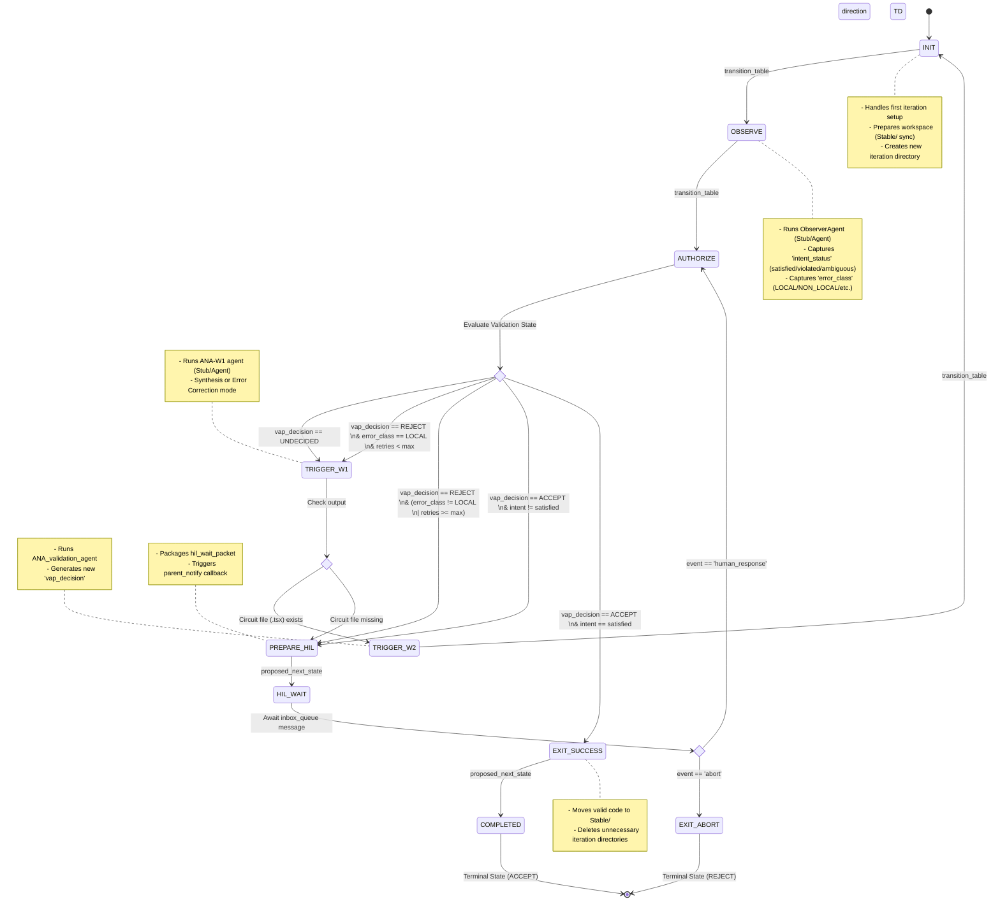

```mermaid
stateDiagram-v2
    direction TD
    
    [*] --> INIT
    
    INIT --> OBSERVE : transition_table
    note right of INIT
        - Handles first iteration setup
        - Prepares workspace (Stable/ sync)
        - Creates new iteration directory
    end note

    OBSERVE --> AUTHORIZE : transition_table
    note right of OBSERVE
        - Runs ObserverAgent (Stub/Agent)
        - Captures 'intent_status' (satisfied/violated/ambiguous)
        - Captures 'error_class' (LOCAL/NON_LOCAL/etc.)
    end note

    state auth_choice <<choice>>
    AUTHORIZE --> auth_choice : Evaluate Validation State

    auth_choice --> TRIGGER_W1 : vap_decision == UNDECIDED
    auth_choice --> TRIGGER_W1 : vap_decision == REJECT \n& error_class == LOCAL \n& retries < max
    auth_choice --> PREPARE_HIL : vap_decision == REJECT \n& (error_class != LOCAL \n| retries >= max)
    auth_choice --> PREPARE_HIL : vap_decision == ACCEPT \n& intent != satisfied
    auth_choice --> EXIT_SUCCESS : vap_decision == ACCEPT \n& intent == satisfied

    state w1_choice <<choice>>
    TRIGGER_W1 --> w1_choice : Check output
    note left of TRIGGER_W1
        - Runs ANA-W1 agent (Stub/Agent)
        - Synthesis or Error Correction mode
    end note
    
    w1_choice --> TRIGGER_W2 : Circuit file (.tsx) exists
    w1_choice --> PREPARE_HIL : Circuit file missing 

    TRIGGER_W2 --> INIT : transition_table
    note left of TRIGGER_W2
        - Runs ANA_validation_agent
        - Generates new 'vap_decision'
    end note

    PREPARE_HIL --> HIL_WAIT : proposed_next_state
    note left of PREPARE_HIL
        - Packages hil_wait_packet
        - Triggers parent_notify callback
    end note

    state hil_choice <<choice>>
    HIL_WAIT --> hil_choice : Await inbox_queue message

    hil_choice --> AUTHORIZE : event == 'human_response'
    hil_choice --> EXIT_ABORT : event == 'abort'
    
    EXIT_SUCCESS --> COMPLETED : proposed_next_state
    note right of EXIT_SUCCESS
        - Moves valid code to Stable/
        - Deletes unnecessary iteration directories
    end note

    EXIT_ABORT --> [*] : Terminal State (REJECT)
    COMPLETED --> [*] : Terminal State (ACCEPT)
```