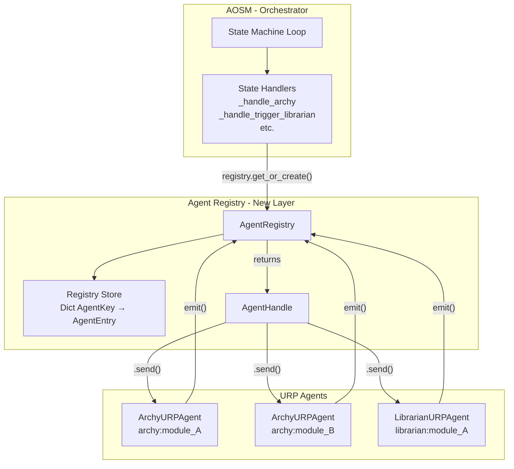

# VHL Agent Registry Layer 

## 1. Purpose

The **Agent Registry** provides a **state-aware interface over persistent URP agents**, enabling AOSM to:

* discover agents
* inspect their state
* determine readiness
* communicate via mailbox

It transforms agents from **function calls → long-lived processes**, while preserving:

> **AOSM as the sole decision authority**

---

## 2. Architecture Overview



---

## 3. Core Model

### 3.1 Agent = Process (URP)

Each agent is a persistent process with:

* lifecycle state:

  ```
  UNINITIALIZED → INITIALIZED → WAITING ↔ PROCESSING → TERMINATED
  ```
* mailbox-driven execution
* event-based output

### 3.2 Registry = Control Surface

The registry is **not a container**.

It:

* tracks agent instances
* exposes state
* computes readiness
* returns communication handles

It does **not**:

* trigger agents
* decide workflows

---

## 4. Identity Model

Two distinct identities are maintained:

### 4.1 Registry Identity (Semantic)

```python
@dataclass(frozen=True)
class AgentKey:
    agent_type: str       # e.g., "archy", "librarian"
    module_name: str      # e.g., "bms-monitor-module"
```

* stable, immutable, hashable
* human-meaningful (string representation: `"archy:bms-monitor-module"`)
* used for lookup and orchestration
* usable as `dict` key

### 4.2 Runtime Identity (Opaque)

```python
runtime_id: str = uuid4()   # assigned per AgentEntry at registration
```

* unique per instance
* used for tracing and observability
* lives in `AgentEntry`, not `AgentKey`

---

## 5. Data Model

### 5.1 AgentEntry (Internal)

```python
@dataclass
class AgentEntry:
    key: AgentKey
    agent: AbstractURPAgent
    runtime_id: str              # UUID, auto-generated
    created_at: datetime         # UTC timestamp
    metadata: Dict[str, Any]     # extensible metadata
```

Never exposed directly to AOSM — the `AgentHandle` provides the external interface.

### 5.2 AgentHandle (External — AOSM-facing)

The **only object AOSM interacts with**. Enforces:
* communication strictly via mailbox
* read-only state inspection
* no direct mutation of agent internals

```python
class AgentHandle:
    async def send(message: MessageEnvelope) -> None   # mailbox delivery
    
    @property key -> AgentKey                          # semantic identity
    @property runtime_id -> str                        # opaque runtime id
    @property state -> Dict[str, Any]                  # read-only agent state
    @property readiness -> AgentReadiness              # system-level readiness
    @property status -> str                            # lifecycle status string
    @property mailbox_size -> int                      # pending messages
    
    def to_dict() -> Dict[str, Any]                    # serializable snapshot
```

The `to_dict()` output matches the design's conceptual response shape:

```python
{
    "key": "archy:bms-monitor-module",
    "runtime": {
        "agent_id": str,
        "status": "WAITING",
        "session_id": str,
        "mailbox_size": 0
    },
    "readiness": "READY",
    "reason": None
}
```

---

## 6. Registry Interface

```python
class AgentRegistry:
    # --- Registration ---
    def register(key, agent, emit_callback?) -> AgentHandle
    def get(key) -> Optional[AgentHandle]
    def get_or_create(key, factory, context?, emit_callback?) -> AgentHandle

    # --- Discovery ---
    def list_agents(agent_type?) -> List[AgentEntry]
    def get_agents_by_type(agent_type) -> Dict[str, AgentHandle]
    def contains(key) -> bool
    @property size -> int

    # --- Lifecycle ---
    async def shutdown_agent(key) -> None
    async def shutdown_all() -> None

    # --- Observability ---
    def snapshot() -> Dict[str, Any]
```

### 6.1 `get_or_create` — Primary Interaction Pattern

This is the main method AOSM will use. It implements **progressive initialization**:

```python
handle = registry.get_or_create(
    key=AgentKey("archy", "bms-monitor-module"),
    factory=lambda k: ArchyURPAgent(),           # called only if agent doesn't exist
    context={"workspace": ws_manager, ...},       # passed to agent.initialize()
    emit_callback=my_emit_fn,                     # wired into the agent
)
```

* If agent exists → returns existing handle (factory NOT called)
* If agent doesn't exist → creates via factory, initializes, registers, returns handle

### 6.2 `shutdown_agent` / `shutdown_all`

Graceful shutdown: calls the URP agent's `shutdown()` method, then deregisters from the store. Errors during shutdown are logged but do not propagate — the agent is always removed.

### 6.3 `snapshot`

Returns a serializable dict of the entire registry state, suitable for heartbeat/telemetry:

```python
{
    "agent_count": 2,
    "agents": {
        "archy:bms-monitor-module": {
            "runtime_id": "...",
            "status": "WAITING",
            "readiness": "READY",
            "mailbox_size": 0,
            "created_at": "2026-05-17T..."
        },
        ...
    }
}
```

---

## 7. Readiness Abstraction

### 7.1 Design

* Readiness is **system-level**, not agent-internal
* Computed by the registry, not by the agent
* Concentrated in a single method: `_compute_readiness()`

Purpose:

> Allow AOSM to decide *when an agent can be invoked*

### 7.2 Current Implementation (V1 — Lifecycle-Only)

```python
class AgentReadiness(Enum):
    READY        = "READY"         # can accept messages
    NOT_READY    = "NOT_READY"     # exists but can't work
    DEGRADED     = "DEGRADED"      # can work with reduced capability
    TERMINATED   = "TERMINATED"    # shut down
```

Mapping from URP lifecycle state:

| Agent Status | Readiness | Rationale |
|:---|:---|:---|
| `WAITING` | `READY` | Agent is idle, can accept messages |
| `PROCESSING` | `NOT_READY` | Agent is busy |
| `INITIALIZED` | `NOT_READY` | Agent not yet started |
| `UNINITIALIZED` | `NOT_READY` | Agent not initialized |
| `ERROR` | `NOT_READY` | Agent in error state |
| `TERMINATING` | `TERMINATED` | Agent shutting down |
| `TERMINATED` | `TERMINATED` | Agent shut down |

### 7.3 Future Extension

External dependency checks (e.g., SCUD exists, libraries resolved) will be added inside `_compute_readiness()`. The method contains a marked extension point:

```python
def _compute_readiness(self, entry: AgentEntry) -> AgentReadiness:
    if status == WAITING:
        # --- Future extension point ---
        # if not self._check_external_dependencies(entry):
        #     return AgentReadiness.DEGRADED
        return AgentReadiness.READY
```

All readiness logic is **isolated and concentrated** in this single method.

---

## 8. Interaction Model

### AOSM → Registry → Agent

```python
key = AgentKey("archy", module_name)

handle = registry.get_or_create(key, factory=create_archy, context={...})

if handle.readiness == AgentReadiness.READY:
    await handle.send(MessageEnvelope(...))
```

* AOSM decides **when**
* Agent executes **how**
* Registry exposes **what is possible**

---

## 9. Initialization Strategy

* Agents are **not globally initialized at startup**
* Initialization is **progressive and dependency-driven** (via `get_or_create`)
* Registry reflects partial availability of agents
* Agents **persist across AOSM state transitions** (created in ARCHY, queryable in WAIT_FOR_ARCHY_HIL, reusable on retry)

---

## 10. Design Constraints

* Registry is **passive** (no control flow)
* Agent state is **read-only externally**
* Communication is **strictly via mailbox**
* System remains **fully observable**
* Single-threaded async (asyncio event loop) — no internal locking

Aligned with:

> **"Systems decide; agents propose"** 

---

## 11. Implementation

### 11.1 File Layout

```
vhl-agent-backend/
├── vhl_common/urp/
│   ├── abstract_urp.py          # URP base class (pre-existing)
│   ├── data_types.py            # MessageEnvelope, EventEnvelope, etc. (pre-existing)
│   ├── agent_key.py             # AgentKey, AgentReadiness, AgentEntry, AgentHandle
│   └── agent_registry.py        # AgentRegistry class
└── tests/urp/
    ├── __init__.py
    └── test_agent_registry.py   # 34 unit tests
```

### 11.2 Dependencies

The registry depends **only** on URP primitives:

* `abstract_urp.AbstractURPAgent`
* `abstract_urp.AgentStatus`
* `data_types.MessageEnvelope`
* `data_types.EventEnvelope`

No dependency on AOSM, workspace manager, LLM, or any agent implementation.

### 11.3 Integration Status

The registry is **implemented and tested but not yet integrated with AOSM**. Integration is deferred pending side-effect evaluation. The planned integration steps are:

1. Add `self.registry = AgentRegistry()` in `AOSM.__init__`
2. Replace inline agent creation in `_handle_archy` with `registry.get_or_create()`
3. Replace inline creation in `_handle_trigger_librarian` similarly
4. Derive `broadcast_agent_state()` from `registry.snapshot()`
5. Call `await self.registry.shutdown_all()` in `_handle_close_project`

### 11.4 Test Coverage

34 unit tests covering:

| Area | Tests | Coverage |
|:---|:---|:---|
| AgentKey identity | 6 | equality, hashing, immutability, str |
| AgentHandle interface | 6 | state, readiness, send, serialization |
| Registration | 4 | register, duplicate rejection, get, contains |
| get_or_create | 3 | factory invocation, reuse, key forwarding |
| Discovery | 4 | list all, filter by type, get_agents_by_type |
| Shutdown | 4 | single, all, nonexistent key, deregistration |
| Readiness | 3 | INITIALIZED→NOT_READY, WAITING→READY, TERMINATED |
| Observability | 3 | snapshot, repr |
| Mailbox delivery | 1 | end-to-end send via handle |

Run with:
```bash
.venv/bin/python -m pytest tests/urp/test_agent_registry.py -v
```

---

## 12. Summary

The Agent Registry introduces:

* persistent agents
* explicit lifecycle visibility
* system-level readiness abstraction
* controlled interaction via handles

While ensuring:

* no authority leakage
* no hidden state
* no implicit assumptions

---

This layer makes **agent existence, state, and eligibility explicit** — without taking over orchestration.
