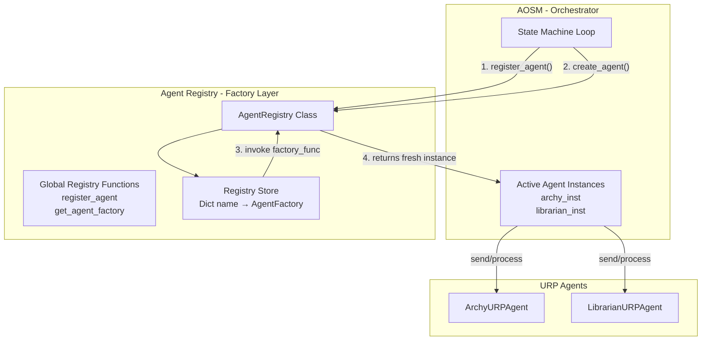

# VHL Agent Registry Layer 

## 1. Purpose

The **Agent Registry** serves as a **lightweight, factory-based registry for URP agents**, enabling:

* global and scoped discovery of agent types/capabilities
* clean registration of agent creator (factory) functions
* decoupled, progressive instantiation of persistent agents

By transitioning from a stateful active-instance tracking container to a factory registry, we maintain:

> **AOSM as the sole decision and execution authority**

State, lifetimes, and event loops are managed completely by the orchestrator or execution environment, eliminating implicit state tracking and authority leakage.

---

## 2. Architecture Overview



---

## 3. Core Model

### 3.1 Agent = Process (URP)

Each agent is a persistent process with standard message-driven, asynchronous execution:
* lifecycle status: `UNINITIALIZED`, `INITIALIZED`, `WAITING`, `PROCESSING`, `TERMINATED`
* mailbox-driven message delivery
* event-based telemetry emission

### 3.2 Registry = Factory Database

The registry is **entirely stateless with respect to active agent executions**.

It:
* maps agent type names (e.g. `"archy"`, `"librarian"`) to their factory creator callables and descriptors
* acts as the single source of truth for available agent capabilities

It does **not**:
* manage active instances
* track lifecycle transitions or readiness
* execute agent loops or handle shutdowns

---

## 4. Identity & Metadata Model

The registry stores metadata of the agent types:

```python
class AgentFactory(NamedTuple):
    factory_func: Callable[..., AbstractURPAgent]
    descriptor: AgentDescriptor
```

* **`factory_func`**: The callable function responsible for instantiating the specific URP agent subclass with dynamic configuration, contexts, or callbacks.
* **`descriptor` (`AgentDescriptor`)**: The standard URP descriptor carrying capabilities, name, agent ID, version, and accepted message types.

---

## 5. Registry Interfaces

We provide both a **global registry** (matching the openhands-sdk paradigm) and a scoped, object-oriented **`AgentRegistry` Class**.

### 5.1 Global Registration API

```python
# Thread-safe global registration APIs
def register_agent(name: str, factory_func: Callable[..., AbstractURPAgent], descriptor: AgentDescriptor) -> None
def register_agent_if_absent(name: str, factory_func: Callable[..., AbstractURPAgent], descriptor: AgentDescriptor) -> bool
def get_agent_factory(name: str) -> AgentFactory
def get_registered_agent_descriptors() -> List[AgentDescriptor]
def add_pre_create_hook(hook: Callable[[str, Any, Any], None]) -> None
def add_post_create_hook(hook: Callable[[str, AbstractURPAgent, Any, Any], None]) -> None
def create_agent(name: str, *args, **kwargs) -> AbstractURPAgent
def _reset_registry_for_tests() -> None
```

### 5.2 Scoped `AgentRegistry` Class

For isolated environments, multi-tenant execution, or scoped testing, the `AgentRegistry` class exposes:

```python
class AgentRegistry:
    def __init__(self)
    
    def register(self, name: str, factory_func: Callable[..., AbstractURPAgent], descriptor: AgentDescriptor) -> None
    def register_if_absent(self, name: str, factory_func: Callable[..., AbstractURPAgent], descriptor: AgentDescriptor) -> bool
    def get_factory(self, name: str) -> AgentFactory
    def get_registered_descriptors(self) -> List[AgentDescriptor]
    def add_pre_create_hook(self, hook: Callable[[str, Any, Any], None]) -> None
    def add_post_create_hook(self, hook: Callable[[str, AbstractURPAgent, Any, Any], None]) -> None
    def create_agent(self, name: str, *args, **kwargs) -> AbstractURPAgent
    
    def contains(self, name: str) -> bool
    def clear(self) -> None
    @property size -> int
```

### 5.3 Pre-create and Post-create Hooks

Execution hooks allow intercepting agent construction seamlessly:
* **Pre-create Hooks**: Registered callables with signature `(name: str, *args, **kwargs) -> None`. Executed *before* the factory function is called. Useful for logging, auditing configuration, or preparing workspace directories.
* **Post-create Hooks**: Registered callables with signature `(name: str, agent: AbstractURPAgent, *args, **kwargs) -> None`. Executed *after* the agent is successfully instantiated. Useful for wire-tapping, adding monitoring, registering telemetry, or automatic starting of agent loops.

Exceptions inside hooks are caught and logged gracefully via the module logger to prevent blocking the core instantiation workflow.

---

## 6. Example Use Cases

### 6.1 Global Registry Example

**Scenario**: Application-wide bootstrapping. A module registers its URP agent subclass factory during system initialization or import time. The main pipeline/orchestration engine can dynamically lookup and instantiate the agent without needing references passed through layers.

```python
# --- archy_agent.py (Registration during module initialization) ---
from vhl_common.urp.agent_registry import register_agent
from vhl_common.urp.data_types import AgentDescriptor

archy_desc = AgentDescriptor(
    agent_id="vhl.archy.v1",
    name="Archy Architect",
    version="1.0",
    capabilities=["SCUD_GENERATION"],
    accepted_message_types=["GENERATE_SCUD"]
)

def create_archy(context=None, emit_callback=None):
    return ArchyURPAgent(descriptor=archy_desc, context=context, emit_callback=emit_callback)

# Globally register the agent type
register_agent("archy", create_archy, archy_desc)


# --- aosm.py (Runtime retrieval & activation) ---
from vhl_common.urp.agent_registry import get_agent_factory

def run_archy_stage(workspace_ctx, telem_cb):
    # Retrieve the global factory dynamically
    factory = get_agent_factory("archy")
    
    # Instantiate agent instance with dynamic session-based context and callbacks
    agent = factory.factory_func(context=workspace_ctx, emit_callback=telem_cb)
    return agent
```

### 6.2 Scoped Registry Example

**Scenario**: Multi-tenant pipelines, sandbox compilation execution, or unit test runners. Each execution session or sandbox creates an independent registry instance, enabling isolated, concurrent, and non-colliding custom factories (e.g. plugins registered dynamically by tenants or mock factories injected for specific test scenarios).

```python
# --- test_compilation.py (Isolated sandbox or testing execution) ---
from vhl_common.urp.agent_registry import AgentRegistry
from vhl_common.urp.data_types import AgentDescriptor

def run_isolated_sandbox_test():
    # Instantiate a clean, scoped registry
    scoped_registry = AgentRegistry()
    
    plugin_desc = AgentDescriptor(
        agent_id="sandbox.custom_compiler.v1",
        name="Dynamic Compiler Plugin",
        version="1.2",
        capabilities=["COMPILE_CIRCUIT"],
        accepted_message_types=["COMPILE"]
    )
    
    # Register compile factory to only this scoped instance
    scoped_registry.register(
        "compiler",
        lambda context=None, emit_callback=None: CustomCompilerAgent(plugin_desc, context, emit_callback),
        plugin_desc
    )
    
    # Create the agent cleanly within the scope
    compiler_agent = scoped_registry.create_agent("compiler", context={"opt_level": 3})
    assert compiler_agent.descriptor.name == "Dynamic Compiler Plugin"
```

---

## 7. Progressive Instantiation Pattern

Under this model, the orchestrator registers the factories once at startup and instantiates the agents on demand with dynamic parameters (e.g. workspace managers, database clients, or emit handlers):

```python
# 1. Register at startup
register_agent("archy", lambda *args, **kwargs: ArchyURPAgent(*args, **kwargs), archy_descriptor)

# 2. Instantiate progressively when entering corresponding state handler
factory = get_agent_factory("archy")
agent_instance = factory.factory_func(
    context=workspace_context,
    emit_callback=telem_callback
)
```

---

## 8. Design Constraints

* **Registry is stateless**: No internal tracking of live connections, event loops, or active handles.
* **Decoupled execution**: State machines and orchestrators remain fully responsible for handling agent tasks and scheduling.
* **Thread safety**: Registry maps are wrapped in a re-entrant lock (`RLock`) to prevent race conditions during concurrent registrations or lookup operations.

---

## 9. Implementation

### 9.1 File Layout

```
vhl-agent-backend/
├── vhl_common/urp/
│   ├── abstract_urp.py          # URP agent base class
│   ├── data_types.py            # AgentDescriptor, MessageEnvelope, etc.
│   └── agent_registry.py        # Factory-based registry functions and class
└── tests/urp/
    └── test_agent_registry.py   # Factory registry test suite
```

### 9.2 Test Coverage

We maintain highly detailed tests covering:
* **Global registry**: Validates safe registration, duplicates rejection, lookup, and cleanup.
* **`AgentRegistry` class**: Validates scoped factory registration, contains checks, size, and clearing.
* **Factory Instantiation**: Validates dynamic parameter forwarding, verifying custom contexts and emit callbacks are accurately supplied to the factory callable.

To execute tests:
```bash
.venv/bin/pytest tests/urp/test_agent_registry.py -v
```
