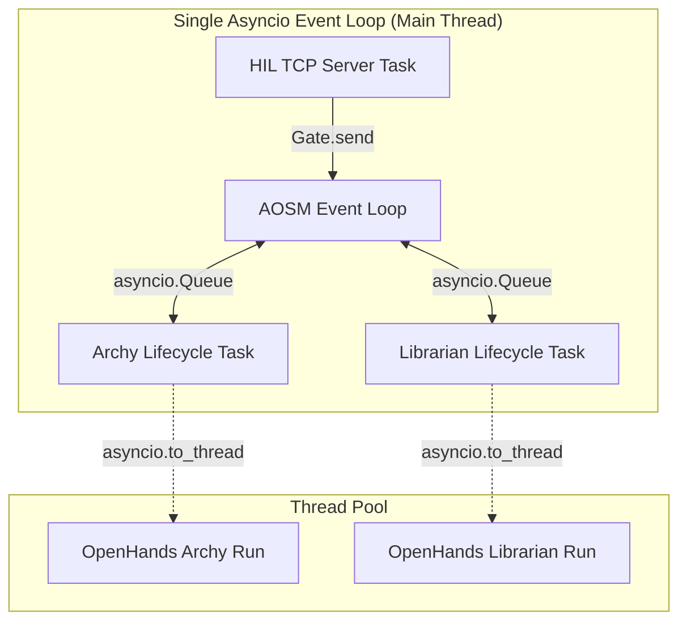
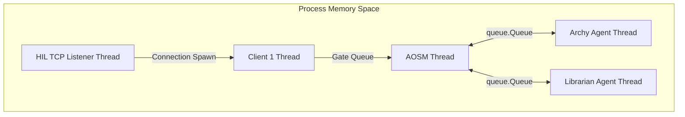
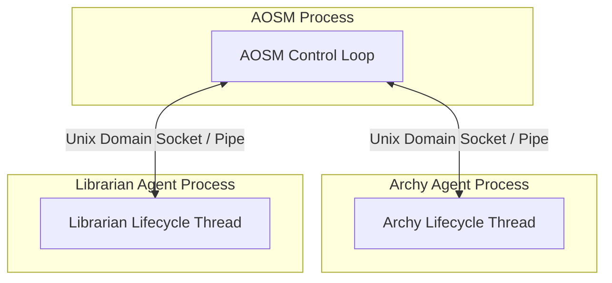

# URP Concurrency Migration Analysis
## Conversion of Asyncio Primitives to OS Primitives

This document provides a detailed technical analysis of the feasibility, complexity, risks, and architectural changes required to migrate the Unified Runtime Primitive (URP), Global Asynchronous Transport Engine (GATE), and the Agentic Orchestration State Machine (AOSM) from cooperative `asyncio` loops to raw OS-level concurrency primitives.

---

## 1. Executive Summary

The VHL URP architecture currently implements a cooperative multi-tasking model built on Python's `asyncio` event loop. It relies on `asyncio` tasks for running agent lifecycles, `asyncio.Queue` for decoupled mailbox-based communication, and `asyncio.to_thread` to bridge blocking synchronous library calls (like the OpenHands agent runtime) into the async reactor loop.

Converting the system to **OS primitives** (either **OS Threads** or **OS Processes**) is **highly feasible** and offers significant benefits in terms of scheduling independence, CPU-bound scaling, and simpler integration with blocking libraries. However, it increases the synchronization overhead and introduces potential deadlock paths if not handled carefully.

| Component / Layer | Primary Async Primitive | Recommended OS Primitive | Migration Complexity | Key Benefit |
| :--- | :--- | :--- | :--- | :--- |
| **Agent Mailbox** | `asyncio.Queue` | `queue.Queue` (threads) or Unix Domain Sockets (processes) | Low | Standardized blocking IPC |
| **Agent Lifecycle** | `asyncio.Task` | `threading.Thread` or `multiprocessing.Process` | Medium | True parallelism, removes thread pools |
| **Coordination Event** | `asyncio.Event` | `threading.Event` or `multiprocessing.Event` | Low | Direct drop-in replacement |
| **Busy Wait Loop** | `asyncio.sleep` | `threading.Condition` / `multiprocessing.Condition` | Low | CPU-efficient waiting |
| **OpenHands Bridge** | `asyncio.to_thread` | Direct synchronous call on dedicated thread | None (Eliminated) | Drastically simplified call stacks |
| **HIL Socket Server** | `asyncio.start_server` | `socketserver.ThreadingTCPServer` | Medium | Decoupled client multiplexing |

---

## 2. Current Concurrency Architecture

The system's current architecture utilizes a single main thread running an `asyncio` event loop, delegating heavy LLM/workspace tasks to worker threads via `asyncio.to_thread`.



---

## 3. Concurrency Primitives Analysis

### 3.1 Mailbox Abstraction (`asyncio.Queue`)
* **Current Usage (`vhl_common/urp/abstract_urp.py`)**:
  `self.mailbox: asyncio.Queue['MessageEnvelope'] = asyncio.Queue()`
  Uses `await self.mailbox.put(message)` for message ingress, and `await asyncio.wait_for(self.mailbox.get(), timeout=MAILBOX_POLL_INTERVAL)` in the run loop.
* **OS Primitives Conversion Options**:
  * **Option A (Multi-threaded)**: `queue.Queue` from Python's standard library. This is a thread-safe FIFO queue backed by OS locks and condition variables.
  * **Option B (Multi-process)**: Unix Domain Sockets (`AF_UNIX` sockets in `SOCK_STREAM` or `SOCK_DGRAM` mode) or POSIX Message Queues (`sysv_ipc` / `posix_ipc` modules).
* **Complexity**: **Low**. If using threads, `queue.Queue` provides a near-identical API. The blocking call `mailbox.get(timeout=...)` raises a standard `queue.Empty` exception which maps directly to `asyncio.TimeoutError`.

### 3.2 Shutdown Coordination (`asyncio.Event`)
* **Current Usage (`vhl_common/urp/abstract_urp.py`)**:
  `self._shutdown_event = asyncio.Event()`
  Used to signal graceful termination of the agent run loop.
* **OS Primitives Conversion Options**:
  * **Option A (Multi-threaded)**: `threading.Event`. This is a direct drop-in replacement with identical method names (`is_set()`, `set()`, `clear()`).
  * **Option B (Multi-process)**: `multiprocessing.Event` or writing a shutdown byte to a control pipe (the "self-pipe" trick to wake up blocking socket/file descriptor `select()` loops).
* **Complexity**: **Low**. Direct class swap in the threaded model.

### 3.3 Agent Lifecycle Runner (`asyncio.Task`)
* **Current Usage (`vhl_common/urp/abstract_urp.py` & `aosm.py`)**:
  `self._task = asyncio.create_task(self._lifecycle_loop())`
* **OS Primitives Conversion Options**:
  * **Option A (Multi-threaded)**: `threading.Thread`. The runner starts a dedicated OS thread.
  * **Option B (Multi-process)**: `multiprocessing.Process`. The agent runs in an isolated operating system process, preventing GIL contention entirely.
* **Complexity**: **Medium**. 
  * In a multi-threaded model, replacing the async loop with a thread is simple. However, error handling changes: unhandled exceptions on a background thread do not automatically crash the main program or bubble up; they must be caught and reported via a shared thread-safe queue.
  * In a multi-process model, Python must serialize (pickle) the agent's initial context (`AgentContext`, LLM handles, DB connections, workspace handles). Objects like DB socket connections or OpenHands instances cannot be easily serialized, requiring initialization to happen *inside* the child process's main loop.

### 3.4 Busy-Polling and Sleeping (`asyncio.sleep`)
* **Current Usage (`vhl_common/urp/abstract_urp.py`)**:
  ```python
  while not self._state.outcome_acknowledged:
      await asyncio.sleep(0.3)
  ```
* **OS Primitives Conversion Options**:
  * `time.sleep(0.3)` is a simple, direct translation but retains the busy-wait polling pattern.
  * **Condition Variable (`threading.Condition` or `multiprocessing.Condition`)**: The agent's thread acquires the condition lock and calls `condition.wait()`. When the orchestrator acknowledges the outcome, it acquires the lock and calls `condition.notify()`.
* **Complexity**: **Low**. Transitioning from busy-polling with sleep to condition variables improves CPU efficiency by completely suspending the thread until notify is called.

### 3.5 Blocking Task Offloading (`asyncio.to_thread`)
* **Current Usage (`urp_librarian.py`, `urp_archy.py`, and `aosm.py`)**:
  `await asyncio.to_thread(self.conversation.run)`
  Required because the OpenHands SDK `conversation.run()` loop is synchronous and blocking.
* **OS Primitives Conversion Options**:
  * **None (Eliminated)**: If each agent runs in its own dedicated OS thread or process, blocking operations are safe. `self.conversation.run()` can be executed directly on the thread without blocking other agents.
* **Complexity**: **None (Architectural Simplification)**. The need for thread pools and complex task offloading completely evaporates in a thread/process-per-agent model.

### 3.6 HIL TCP Socket Server (`asyncio.start_server`)
* **Current Usage (`vhl_common/gate/hil.py`)**:
  `self._server = await asyncio.start_server(self._handle_client, self.host, self.port)`
  Multiplexes reading client lines and routing them to the GATE.
* **OS Primitives Conversion Options**:
  * **Option A**: `socketserver.ThreadingTCPServer` from the standard library.
  * **Option B**: A raw socket listener loop running in a dedicated thread, spawning a new thread for each client socket connection, or using `selectors` (wrapping system calls like `epoll` or `select`) for non-blocking single-threaded multiplexing.
* **Complexity**: **Medium**. Rewriting the server to use OS threads requires thread-safe socket writing and handling client connection tracking with locks (e.g., protecting `self._clients`).

---

## 4. Proposed Target Architectures

### Option A: Single-Process, Multi-Threaded
Ideal if VHL wants to keep memory footprint minimal and doesn't suffer from GIL bottlenecks.



> [!NOTE]
> Since the OpenHands SDK relies on running LLM prompts and local file editing tools, it is mostly I/O bound. A multi-threaded architecture is highly viable and does not suffer from GIL constraints since Python releases the GIL during network calls and I/O.

### Option B: Multi-Process (Full OS Isolation)
Ideal for security, process stability, and language neutrality (e.g., aligning with the C implementation of `tiny-agent`).



---

## 5. Risk and Portability Assessment

### 5.1 Portability
* **POSIX-specific primitives**: If the system transitions to Unix Domain Sockets (`AF_UNIX`), it will restrict execution strictly to POSIX systems (Linux/macOS). Windows does support `AF_UNIX` in newer builds, but it remains error-prone.
* **Recommendation**: If multi-process is chosen, use cross-platform TCP loopback sockets (`127.0.0.1`) or Python's `multiprocessing` abstractions (pipes/queues) which automatically negotiate OS-specific details underneath.

### 5.2 GIL and CPU Overhead
* **CPU Bound Operations**: The LLM parsing and tool calls can sometimes invoke local Python processors (like AST parsing in openhands). 
* **Recommendation**: Running each agent on a separate OS process guarantees they will never block each other's execution regardless of thread scheduling.

### 5.3 Deadlocks
* In a synchronous thread/process architecture, if Agent A blocks waiting for a response from Agent B, and Agent B blocks waiting for Agent A, a deadlock occurs.
* In the async model, this would still lock up logical flows but wouldn't starve CPU resource threads. 
* **Mitigation**: Mailboxes should always remain asynchronous. Message insertion (`send()`) must never block. Only the reading loop (`process()`) should block waiting for new messages.

---

## 6. Migration Guide (Step-by-Step)

If a migration is requested, follow this sequence:

1. **Refactor URP Data Types**: Make sure `MessageEnvelope` is fully serializable if moving to a multi-process architecture.
2. **Reimplement `AbstractURPAgent` using Threads**:
   * Swap `asyncio.Queue` for `queue.Queue`.
   * Swap `asyncio.Event` for `threading.Event`.
   * Reimplement `start()` to spawn a `threading.Thread`.
   * Replace `_lifecycle_loop` async keywords with standard synchronous syntax.
3. **Simplify Agents (`Archy`, `Librarian`)**:
   * Remove `async` and `await` keywords from `process()` and lifecycle hooks.
   * Call `self.conversation.run()` directly instead of wrapping in `asyncio.to_thread`.
4. **Rewrite HIL Terminal**:
   * Use `socketserver.ThreadingTCPServer` to manage TCP connection sockets.
5. **Adjust AOSM Controller**:
   * Convert the orchestrator loop to block on a `queue.Queue` or select loop.
